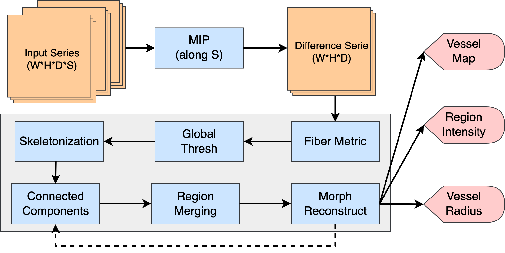
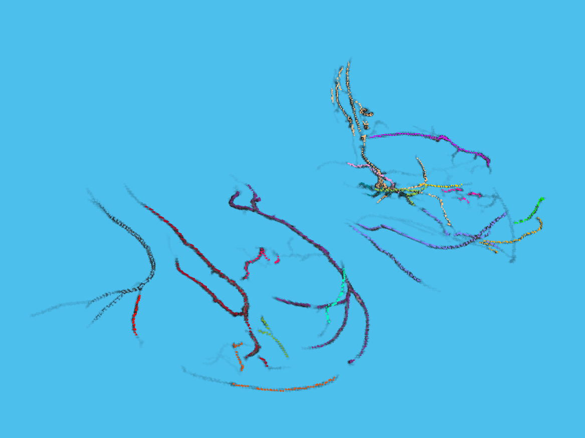

# Vasculature Analysis in Breast Cancer Using DCE-MRI

## E4830 Digital Image Processing: Project

This project seeks to propose and implement a fully automated algorithm pipeline for identification, segmentation and quantification of vascular structure in breast cancer using clinical DCE-MR images. Experiments were conducted and the results obtained were analyzed comparatively to build association with the patients pathological responses. 

## Description

The project was conducted in 4 stages. 

- Preprocessing: MIP, contrast enhancement
- Segmentation: Frangi's filtering
- Skeletonization: global thresholding, connected components analysis, morphological reconstruction
- Quantification: vessel length and radius

## Results

## Acknowledgement

Many loves and thanks to Lucy, who has been selflessly providing professional interpretations and insights from the perspective of a clinical medical student dedicated in the diagnosis and treatment of breast cancer. 

## References

[1] G. Carpentier et al., “Angiogenesis Analyzer for ImageJ — A comparative morphometric analysis of ‘Endothelial Tube Formation Assay’ and ‘Fibrin Bead Assay,’” Sci Rep, vol. 10, no. 1, Art. no. 1, Jul. 2020, doi: 10.1038/s41598-020-67289-8.

[2] C. N. Doukas, I. Maglogiannis, A. Chatziioannou, and A. Papapetropoulos, “Automated angiogenesis quantification through advanced image processing techniques,” Conf Proc IEEE Eng Med Biol Soc, vol. 2006, pp. 2345–2348, 2006, doi: 10.1109/IEMBS.2006.260675.

[3] M. Wang, L.-L. S. Ong, J. Dauwels, and H. H. Asada, “Automated tracking and quantification of angiogenic vessel formation in 3D microfluidic devices,” PLoS ONE, vol. 12, no. 11, p. e0186465, Nov. 2017, doi: 10.1371/journal.pone.0186465.

[4] A. Petrillo et al., “Breast Contrast Enhanced MR Imaging: Semi-Automatic Detection of Vascular Map and Predominant Feeding Vessel,” PLOS ONE, vol. 11, no. 8, p. e0161691, Aug. 2016, doi: 10.1371/journal.pone.0161691.

[5] N. Onishi et al., “Breast MRI during Neoadjuvant Chemotherapy: Lack of Background Parenchymal Enhancement Suppression and Inferior Treatment Response,” Radiology, vol. 301, no. 2, pp. 295–308, Nov. 2021, doi: 10.1148/radiol.2021203645.

[6] C. N. Doukas, I. Maglogiannis, and A. A. Chatziioannou, “Computer-Supported Angiogenesis Quantification Using Image Analysis and Statistical Averaging,” IEEE Transactions on Information Technology in Biomedicine, vol. 12, no. 5, pp. 650–657, Sep. 2008, doi: 10.1109/TITB.2008.926463.

[7] T. Nielsen, T. Wittenborn, and M. R. Horsman, “Dynamic Contrast-Enhanced Magnetic Resonance Imaging (DCE-MRI) in Preclinical Studies of Antivascular Treatments,” Pharmaceutics, vol. 4, no. 4, pp. 563–589, Nov. 2012, doi: 10.3390/pharmaceutics4040563.

[8] L.-A. Wu et al., “Evaluation of the treatment response to neoadjuvant chemotherapy in locally advanced breast cancer using combined magnetic resonance vascular maps and apparent diffusion coefficient,” J Magn Reson Imaging, vol. 42, no. 5, pp. 1407–1420, Nov. 2015, doi: 10.1002/jmri.24915.

[9] Y. Zhong, “Extracting Vessel Structure From 3D Image Data,” p. 98.

[10] A. F. Frangi, W. J. Niessen, K. L. Vincken, and M. A. Viergever, “Multiscale vessel enhancement filtering,” in Medical Image Computing and Computer-Assisted Intervention — MICCAI’98, vol. 1496, W. M. Wells, A. Colchester, and S. Delp, Eds. Berlin, Heidelberg: Springer Berlin Heidelberg, 1998, pp. 130–137. doi: 10.1007/BFb0056195.

[11] M. E. Seaman, S. M. Peirce, and K. Kelly, “Rapid Analysis of Vessel Elements (RAVE): A Tool for Studying Physiologic, Pathologic and Tumor Angiogenesis,” PLoS One, vol. 6, no. 6, p. e20807, Jun. 2011, doi: 10.1371/journal.pone.0020807.

[12] B. J. Vakoc et al., “Three-dimensional microscopy of the tumor microenvironment in vivo using optical frequency domain imaging,” Nat Med, vol. 15, no. 10, pp. 1219–1223, Oct. 2009, doi: 10.1038/nm.1971.

[13] W. Huang et al., “Variations of Dynamic Contrast-Enhanced Magnetic Resonance Imaging in Evaluation of Breast Cancer Therapy Response: A Multicenter Data Analysis Challenge,” Translational Oncology, vol. 7, no. 1, pp. 153–166, Feb. 2014, doi: 10.1593/tlo.13838.
